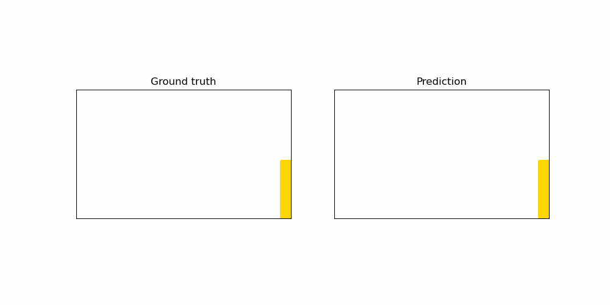
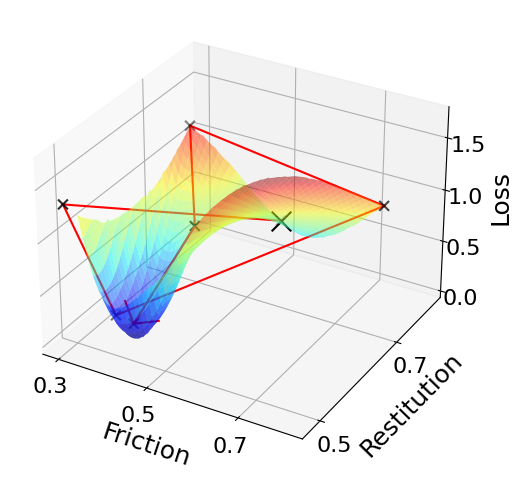

# gns4demdesign

## Introduction

Code for DEM parameter optimization based on Graph Neural Network based surrogate modeling. 

## DEM Dataset
Sample dataset provided: 50 DEM simulation for granular collapse, with different friction and resitution coefficient, varying at [0.3, 0.9] for both, provided by MFiX software. All 50 trajectories share the same initial column of particles. 

## Example usage: train a model and inverse design

**Train a model:**

- Step 1: Set line 19/20/21 with the right directory to use
- Step 2: Set the planned parameter values from line 27 to line 36
- Step 3:

    python gpu_train_or_infer_friction_restitution.py

**Generate trajectory rollout from a trained model:**
- Step 1: Change line 41 to "False", uncomment line 42 and provide the actual model checkpoint file generated from training session, comment line 43.
- Step 2:

    python gpu_train_or_infer_friction_restitution.py

**Render trajectory rollout and output to a gif:**
    python render_rollout.py --rollout_path="path_to_rollout/rollout_0.pkl"

**Inverse design of DEM parameters:**
- Step 1: Change line line 42 of *learnedsimulator_calling_2.py* with the actual model checkpoint file generated from training session 
- Step 2: 

    python inverse_design3.py
    

**Visualize the optimization process:**

- Step 1: Record the output from the optimization process, extract different pair of friction/restitution values from different steps, put them into "data_points" in *plot_3d_surface_optimization.py*
-  Step 2: 
   
    python plot_3d_surface_optimization.py

## Code Structure

* 'gpu_train_or_infer_friction_restitution.py' : Script for training, evaluating, generating rollout trajectories.
* 'learnedsimulator_calling_2.py': Replicate of code for generating rollout trajectories, with friction/restitution as parameters input to the simulator.
* 'inverse_optimizer3.py': Script for optimization procedure of DEM parameters, starting from a pair of initial values of friction/restitution, stopping at optimized pair of values. 
* 'reading_utils_friction_restitution.py': Utility module for reading from tensorflow dataset
* 'render_rollout.py': Visualization code for displaying rollouts such as the example animation.
* 'get_optimized_rollout.py': Script for getting rollout trajectories once optimized pair of friction/restitution values are derived

## Inspired by

- https://github.com/google-deepmind/deepmind-research/tree/master/learning_to_simulate
